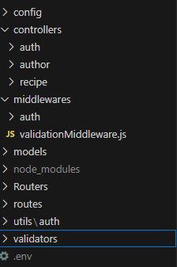

Proyecto de Programación Web - Aplicación SPA con React

Este proyecto es una API RESTful desarrollada con Node.js y Express. Permite realizar operaciones CRUD sobre dos entidades: una principal (Recetas) y una de soporte (Autores). El proyecto incluye autenticación, validación de datos y manejo de errores centralizado.

Funcionalidades Principales

Autenticación
Módulo de ABMC (Alta, Baja, Modificación, Consulta)
Validación

Tecnologías Utilizadas

Hosting gratuito: Despliegue en Render (Render.com) y Mongodb (mongodb.com) para acceso en línea de la aplicación.
Git: Uso de Git para el control de versiones y colaboración

Estructura del proyecto

Instrucciones de uso

Clonar el repositorio
Instalar dependencias
Iniciar el servidor de desarrollo

Contribuidores

Ybañez Cesar https://github.com/Juk-Juk
Franco Sanchez https://github.com/MastahhDev